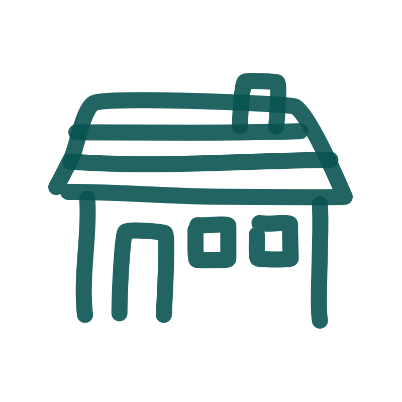
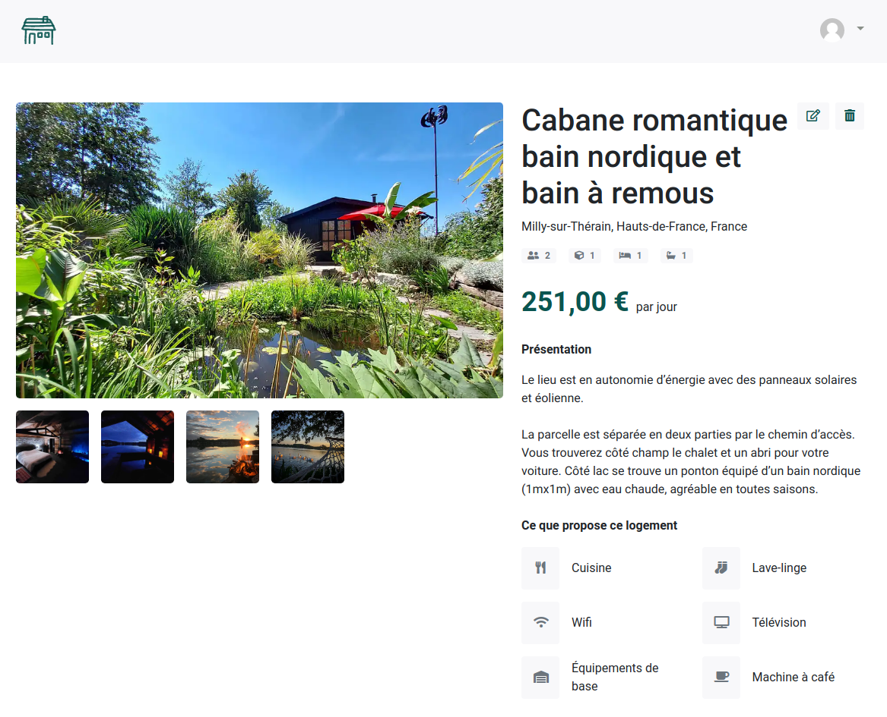

  

<h3 align="center">Rails Room Booking</h3>

Open-source solution for hotel and vacation rental management, offering online reservation processes, and secure online payment transactions.

___

## Status 🚧

This project is under construction. Stay tuned for exciting updates as I continue to shape it.

## Features ✅

- **Sign up / Log in**: Simply create an account or log in to access the platform.

- **Management of your homes**: Effortlessly handle your property portfolio, including adding, editing, and managing various details such as property descriptions, options, and pricing.

## Upcoming features 🚀

- **Online booking**: Enable your customers to easily make reservations for your accommodations directly through the platform, streamlining the booking process for a seamless user experience.

- **Online payment via Stripe**: Facilitate secure online payments by integrating with Stripe, a trusted payment gateway, allowing your users to make payments conveniently and securely.

- **Synchronization of availability with Airbnb**: Automatically synchronize the availability of your accommodations with Airbnb, ensuring consistent and up-to-date availability across platforms, saving you time and effort in managing multiple calendars.

## Dependencies

This project has been developed using the following key dependencies:

- **Ruby**: Version 2.7.5
- **Rails**: Version 7.0.4
- **Bootstrap**: Version 5.1
- **Rspec**
- **Rubocop**
- **Sass**

## Installation

To launch the application, follow these steps: 

1. Run `bundle install`
2. Run `rails db:create`
3. Run `rails db:migrate`
4. Run `rails db:seed`
5. Run `yarn install`
6. Run `rails s`

Then, open your browser and navigate to http://localhost:3000 to access the application.

## Tests

To run the tests, execute `rspec` command.
