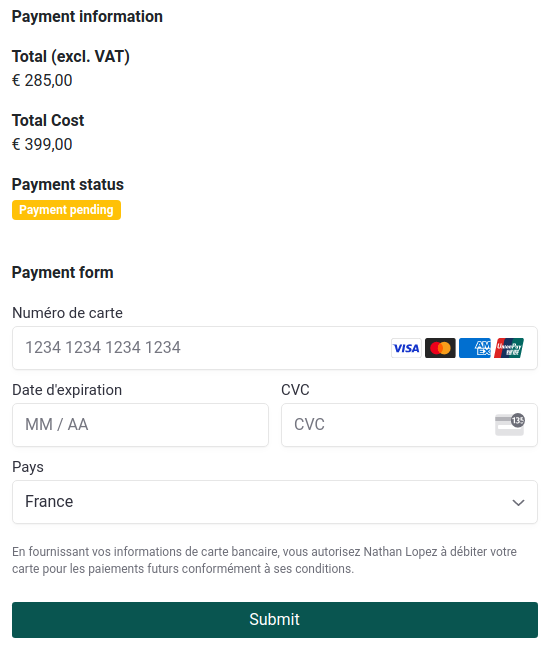
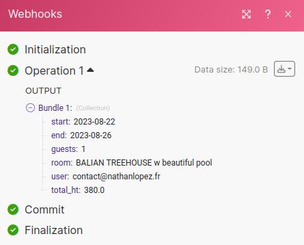

<p align="center">
  
</p>

<h3 align="center">Rails Room Booking</h3>

<span>[](https://github.com/andrewdsilva/rails-room-booking)</span> <span>
</span> <span>
[](http://opensource.org/licenses/MIT)</span>

Open-source solution for hotel and vacation rental management, offering online reservation processes, and secure online payment transactions.


___

## Features ✅

- **Sign up / Log in**: Simply create an account or log in to access the platform.

- **Management of your homes 🏘️**: Effortlessly handle your property portfolio, including adding, editing, and managing various details such as property descriptions, options, and pricing.

- **Online booking**: Enable your customers to easily make reservations for your accommodations directly through the platform, streamlining the booking process for a seamless user experience.

- **Account settings**: Management of your preferences (VAT rates, etc.)

- **Online payment via Stripe 💳**: Facilitate secure online payments by integrating with Stripe, a trusted payment gateway, allowing your users to make payments conveniently and securely.

- **Webhook Integration with Integromat (Make) 🤖**: Connect your booking system with Integromat to initiate automated workflows, such as sending booking notifications, updating external databases, or integrating with other applications for further automation and data handling.

## Upcoming features 🚀

- **Synchronization of availability with Airbnb**: Automatically synchronize the availability of your accommodations with Airbnb, ensuring consistent and up-to-date availability across platforms, saving you time and effort in managing multiple calendars.

## Dependencies

This project has been developed using the following key dependencies:

- **Ruby**: Version 2.7.5
- **Rails**: Version 7.0.4
- **Bootstrap**: Version 5.1
- **Rspec**
- **Rubocop**
- **Sass**
- **Payify**
- **Integromat**
- **Stripe**

## Online payment

To use online payment for bookings, you need to have a Stripe account.

You can set your Stripe API credentials and define currency using environment variables. (Secret key, Publishable key)

```ruby
# .env
STRIPE_API_KEY="..."
STRIPE_PUBLISHABLE_KEY="..."
```



## Integromat Webhook (Make)

[Integromat](https://www.make.com/en) is a powerful automation platform that allows you to connect various apps and services, enabling you to automate workflows and streamline your business processes. By integrating Integromat with your booking system, you can enhance the functionality and efficiency of your booking process.

To set up the Integromat integration and receive a webhook for each reservation made, follow these steps:

1. Sign up for an account on [Integromat](https://www.make.com/) if you don't have one already.

2. Create a new scenario in Integromat to define the actions you want to perform when a booking is made.

3. In your Rails project, add the following environment variables to your configuration:

   ```ruby
   INTEGROMAT_BASE_URI="https://hook.eu2.make.com"
   INTEGROMAT_BOOKING_HOOK="odsdispsdsbseb1hrjqe56jqm35snc"
   ```

   Replace the values above with your own Integromat base URI and booking hook.

4. Whenever a booking is made in your booking system, a webhook will be triggered and sent to the specified Integromat hook. You can then use this webhook to automate processes in your Integromat scenario, such as sending notifications, updating external systems, or performing any custom actions you require.



## Translations

By default two languages are available, a language selector in the footer allows you to change the interface language.

- French 🇫🇷
- English 🇺🇸

## Installation

To launch the application, follow these steps:

1. Run `bundle install`
2. Run `rails db:create`
3. Run `rails db:migrate`
4. Run `rails db:seed`
6. Run `rails s`

Then, open your browser and navigate to http://localhost:3000 to access the application.

## Tests

To run the tests, execute `rspec` command.
